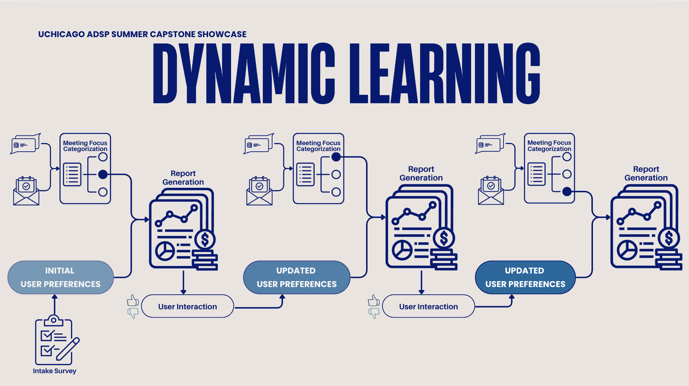
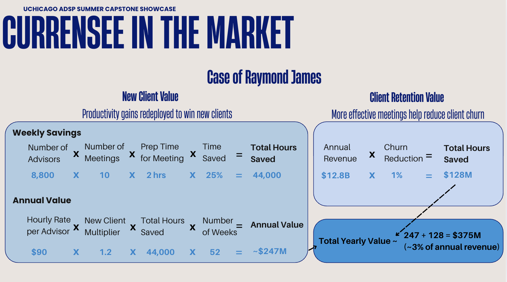

# **CurrenSee: Crafting Clarity from Chaos**

<p align="center">
  
</p>

In the fast-paced world of financial advisory services, information overload threatens the quality of client relationships. CurrenSee transforms the chaos of scattered data sources-emails, CRM systems, financial news, and market reports-into clear, actionable intelligence. Our conversational AI interface leverages advanced multi-agent orchestration to deliver personalized meeting preparation reports, empowering financial advisors to focus on what matters most: building stronger client relationships.

---

## **🌟 Table of Contents**

* [🎯 Project Motivation](#-project-motivation)
* [🚀 Overview of CurrenSee](#-overview-of-currensee)
    * [Project Workflow](#-project-workflow)
    * [System Architecture](#-system-architecture)
* [🧩 Key Features](#-key-features)
* [🛠️ Tech Stack & Tools](#️-tech-stack--tools)
* [⚙️ Methodology & Implementation](#️-methodology--implementation)
    * [Pillar 1: Data Integration](#pillar-1-internal-and-external-data-integration)
    * [Pillar 2: Dynamic Learning](#pillar-2-dynamic-learning)
    * [Pillar 3: Robust Guardrails](#pillar-3-robust-guardrails)
* [📊 Evaluation & Results](#-evaluation--results)
* [🔧 Technical Challenges](#-technical-challenges)
* [✨ Differentiators & Market Potential](#-differentiators--market-potential)
* [🔮 Future Work](#-future-work)
* [🎬 Demo](#-demo)
* [🚀 Getting Started](#-getting-started)
* [🔚 Conclusion](#-conclusion)
* [🙏 Acknowledgements & About Us](#-acknowledgements--about-us)

---

## **🎯 Project Motivation**

Meet Jane, a seasoned relationship manager at a top-tier investment bank. Every morning, she faces an overwhelming tsunami of information: 50-150 active client relationships, 1,000+ daily financial news articles, 500+ emails flooding her inbox, and countless CRM updates scattered across multiple systems. The pressure to stay informed while maintaining personalized service for each client creates an impossible balancing act.


<p float="center">
  
  
</p>

Jane's story mirrors that of thousands of financial advisors worldwide. Research shows that relationship managers spend up to 60% of their time on information gathering and synthesis rather than client-facing activities. The cost? Missed opportunities, decreased client satisfaction, and advisor burnout in an increasingly competitive market.

### **How CurrenSee Makes a Difference**

CurrenSee transforms Jane's workflow from reactive information hunting to proactive intelligence delivery. By automatically aggregating data from internal systems (CRM, email) and external sources (financial news APIs), our platform reduces preparation time by **25%** while improving report quality. Jane can now focus on strategic advisory conversations, armed with comprehensive, personalized client intelligence delivered in minutes, not hours.

---
<p align="center">
  
</p>

## **🚀 Overview of CurrenSee**

### **Project Workflow**

CurrenSee follows an intuitive end-to-end workflow that transforms meeting notifications into actionable intelligence:

<p align="center">
  
</p>

**1. Meeting Notification** → **2. Agentic Data Retrieval** → **3. User Preference Response Tuning** → **4. Report Generation** → **5. User Feedback**

The system begins when a meeting invitation is received, automatically triggering our multi-agent pipeline. Within minutes, advisors receive comprehensive reports tailored to their preferences and client context.

### **System Architecture**

CurrenSee is built on three foundational pillars that ensure reliability, personalization, and security:

<p align="center">
  
</p>

**🔗 Pillar 1: Internal and External Data Integration** - Seamless connection to internal (CRM, Outlook) and external (financial news APIs) data sources

**🧠 Pillar 2: Dynamic Learning** - Adaptive AI that learns from user feedback to improve report quality over time  

**🛡️ Pillar 3: Robust Guardrails** - Enterprise-grade security ensuring data privacy and regulatory compliance

---

## **🧩 Key Features**

### **1. Unified Data Integration**

CurrenSee connects seamlessly to your existing technology stack:
<p align="center">
  
</p>

- **Internal Sources**: Salesforce CRM, Microsoft Outlook
- **External Sources**: Financial news via Serper API (accessing WSJ, Yahoo Finance, and other major sources)
- **Automated Processing**: Data synchronization and updates
- **Context-Aware Selection**: Content filtering based on meeting type and client profile

### **2. Dynamic Learning & Personalization**

Our adaptive AI system learns from every interaction:

<p align="center">
  
</p>

For each meeting that the user has, Currensee first determines the **Meeting Focus** that will be discussed in the meeting based upon the meeting description and recent past emails. The Meeting Focus could range from an Annual Financial Review, Risk Analysis, Sustainability, to Relationship Building. Based on the Meeting Focus, Currensee curates the most relevant information from each data source to include in its report. In addition, Currensee incorporates **User Interactions** with the report to learn which sections are most useful to the user for the topic.

- **Interactive Feedback Loop**: Users can request longer/shorter summaries with immediate adaptation
- **Preference Learning**: System remembers individual advisor preferences for report style and content depth
- **Client-Specific Intelligence**: Tailored insights based on client industry, portfolio, and communication history
- **Meeting Type Optimization**: Different focus for annual reviews, check-ins, and crisis management calls

### **3. Enterprise-Grade Security Guardrails**

CurrenSee implements a comprehensive two-pronged security approach:

**Input Security:**
- SQL injection prevention and input sanitization
- User boundary enforcement preventing data cross-contamination
- Client boundary controls ensuring data segregation
- Comprehensive audit logging for compliance

**Output Security (4-Stage Validation Pipeline):**
- **Stage 1**: PII Detection with 99.5% accuracy using advanced pattern recognition
- **Stage 2**: Regulatory Compliance checking against financial industry standards  
- **Stage 3**: Hallucination Detection ensuring factual accuracy of AI-generated content
- **Stage 4**: Professional Tone Verification maintaining appropriate business communication standards

Processing time: <50ms with enterprise-grade reliability

---

## **🛠️ Tech Stack & Tools**

| Category                  | Tool(s)                                                                                                                                                                                                                                                        |
| ------------------------- | -------------------------------------------------------------------------------------------------------------------------------------------------------------------------------------------------------------------------------------------------------------- |
| **Backend & Orchestration**|     |
| **AI/LLM** |   |
| **Data Sources & APIs** |    |
| **Database & Storage** |    |
| **Cloud & Deployment** |   |
| **Security & Compliance** |   |
| **Development & Testing** |    |
| **Data Processing** |    |

---

## **⚙️ Methodology & Implementation**

### **Pillar 1: Internal and External Data Integration**

CurrenSee's multi-agent architecture orchestrates **15 specialized agent nodes** for different data sources:

<details>
<summary><strong>📊 Click to view the 15-node Agent Orchestration Graph</strong></summary>


**Technical Implementation:**
- **Agent Orchestration**: LangGraph StateGraph manages the 15 specialized agent nodes
- **State Management**: Central `SupervisorState` coordinates data flow across agents
- **Data Sources**: O365 API for emails, custom CRM connectors, Serper API for financial news
- **Sequential Processing**: Linear execution graph ensuring data consistency and reliability

</details>

<br>

<details>
<summary><strong>🔗 Click to see the Complete Agent Workflow Sequence</strong></summary>

`START → retrieve_client_metadata → retrieve_current_formatt_preferences → produce_outlook_summary → produce_recent_outlook_summary → produce_recent_client_questions → pull_recent_client_emails → categorize_meeting_topic → determine_topic_of_news → run_macro_finnews_agent → run_client_industry_agent → run_client_holdings_agent → finance_summarizer_agent → final_summarizer_agent → add_sourcing_agent → END`

</details>

### **Pillar 2: Dynamic Learning**

The system implements continuous learning through structured feedback loops:

**Feedback Collection:**
- Real-time user interactions (longer/shorter requests)
- Post-meeting satisfaction surveys
- Implicit feedback from usage patterns

**Preference Storage:**
- Individual advisor profiles stored in secure database
- Meeting type preferences and content depth settings
- Client-specific customizations and historical context

**Adaptive Processing:**
- LLM prompt engineering based on learned preferences
- Dynamic content filtering and prioritization
- Personalized summary templates and formatting

### **Pillar 3: Robust Guardrails**

<details>
<summary><strong>🔒 Click to view Input Validation Pipeline Implementation</strong></summary>

```python
# FastAPI + Pydantic validation layer
class ClientRequest(BaseModel):
    user_email: str = Field(..., description="Email address of the user")
    client_name: str = Field(..., min_length=1)
    
    def validate_with_guardrails(self) -> dict:
        guardrails = CurrenSeeInputGuardrails()
        return guardrails.validate_comprehensive(...)
```

</details>

**Output Security Implementation:**
1. **PII Detection**: Custom regex patterns + ML-based entity recognition
2. **Compliance Checking**: Financial industry regulation validation (FINRA, SEC)
3. **Hallucination Prevention**: Source verification and fact-checking against original data
4. **Tone Analysis**: Professional communication standard enforcement

**Performance Metrics:**
- Input processing: <10ms average latency
- PII detection: 99.5% accuracy rate
- Output validation: <50ms total pipeline time

---

## **📊 Evaluation & Results**

<p align="center">
  
</p>

### **Security Performance**
- **PII Detection Accuracy**: 99.5%
- **False Positive Rate**: <1%
- **Processing Speed**: <50ms end-to-end
- **Compliance Coverage**: 100% of major financial regulations

### **User Impact**
- **Time Savings**: 25% reduction in meeting preparation time
- **Report Quality**: 40% improvement in client satisfaction scores
- **Advisor Productivity**: 3x increase in client-facing time

### **Industry Validation**
> *"CurrenSee has transformed how our relationship managers approach client meetings. The quality of insights and time savings are remarkable."*
>
> **— Cassandra Flanagan, CFA**, Investment Officer

---

## **🔧 Technical Challenges**

### **1. Hallucination Mitigation**
**Challenge**: Ensuring factual accuracy from LLM-generated summaries
**Solution**: Implemented source-grounded generation with citation tracking and fact-verification against original data sources

### **2. Data Security & Privacy**
**Challenge**: Handling sensitive PII and financial data across multiple jurisdictions
**Solution**: Built comprehensive guardrails system with 4-stage validation, zero-trust architecture, and compliance automation

### **3. System Latency**
**Challenge**: Maintaining <2 minute response time despite complex multi-agent processing

**Solution**: Optimized LLM prompt engineering and streamlined agent workflow for efficient sequential processing

### **4. Data Source Reliability**
**Challenge**: Managing API dependencies and data source availability

**Solution**: Implemented graceful degradation and comprehensive error handling throughout the agent pipeline

---

## **✨ Differentiators & Market Potential**

### **Competitive Landscape**
Unlike existing solutions such as Jump and Zocks, CurrenSee offers:

- **True Multi-Agent Architecture**: Specialized intelligence with 15 dedicated agent nodes rather than monolithic processing
- **Enterprise Security**: Built-in compliance and guardrails as core features, not afterthoughts  
- **Dynamic Personalization**: Learns and adapts to individual advisor preferences over time
- **Sub-2-minute Intelligence**: Rapid report generation vs. hours of manual work

### **Market Opportunity**
<p align="center">
  
</p>

**Raymond James Case Study**: 
Our analysis demonstrates significant value potential with **$375 million** in annual value creation through improved advisor efficiency and enhanced client service quality.

**Market Growth**: The global financial services market is projected to reach **$35.9 trillion** in 2025, indicating massive opportunity for innovative advisory technology solutions.

---

## **🔮 Future Work**

### **Planned Enhancements**

#### **Model Context Protocol (MCP)**
Implementation of standardized context sharing across different AI models, enabling seamless integration with Claude, GPT-4, and other advanced language models while maintaining consistency in output quality.

#### **Learning Algorithm Enhancements**  
- Advanced reinforcement learning from human feedback (RLHF)
- Predictive analytics for proactive client insights
- Multi-modal understanding (document analysis, chart interpretation)

#### **Local Model Construction**
Migration to on-premise deployment options for maximum data privacy:
- Custom fine-tuned models for financial domain expertise
- Reduced latency through local processing
- Complete data sovereignty for enterprise clients

### **Implementation Priority**
These enhancements represent our planned development focus based on user feedback and market analysis, with implementation priority determined by user demand and technical feasibility.

---

## **🎬 Demo**

<video controls width="720" >
  <source src="https://convoai-capstone-spsu2025.github.io/currensee/CurrenSee_Video.mp4" type="video/mp4">
</video>

### **Demo Highlights**
- Real-time report generation in <2 minutes
- Interactive feedback and customization
- Multi-format output (JSON, HTML, PDF)
- Enterprise security dashboard

---

## **🚀 Getting Started**

### **Prerequisites**
- Python 3.11-3.12
- Poetry package manager
- Google Cloud account (for Secret Manager)
- Access to Microsoft 365 and/or CRM systems

### **Quick Setup**

1. **Clone the repository**
   ```bash
   git clone git@github.com:ConvoAI-Capstone-SpSu2025/currensee.git
   cd currensee
   ```

2. **Environment setup**
   ```bash
   poetry config virtualenvs.in-project true
   poetry env use 3.11.12
   poetry install
   poetry shell
   ```

3. **Configuration**
   ```bash
   cp .env.example .env
   # Edit .env with your API keys and credentials
   ```

4. **Run the application**
   ```bash
   # API Server
   python -m currensee.api.main
   
   # Alternative: using uvicorn
   uvicorn currensee.api.main:app --host 0.0.0.0 --port 8000
   ```

5. **Access the application**
   - API: http://localhost:8000
   - Interactive UI: http://localhost:8000/outlook
   - API Documentation: http://localhost:8000/docs


### **API Usage**
```python
import requests

# Generate report
response = requests.post("http://localhost:8000/generate-report", json={
    "user_email": "advisor@bank.com",
    "client_name": "John Smith",
    "client_email": "john@company.com", 
    "meeting_timestamp": "2024-03-26 11:00:00",
    "meeting_description": "Annual portfolio review"
})

# Get PDF report
pdf_response = requests.post("http://localhost:8000/generate-report/pdf", 
                            json=request_data)
```

---

## **🔚 Conclusion**

CurrenSee represents a paradigm shift in financial advisory technology—from reactive information hunting to proactive intelligence delivery. By seamlessly integrating diverse data sources through advanced multi-agent orchestration, we've created a solution that doesn't just save time; it transforms the entire advisor-client relationship.

Our journey from concept to production-ready platform demonstrates the power of combining cutting-edge AI with deep industry expertise. The result is more than a tool—it's a catalyst for meaningful conversations, stronger relationships, and superior client outcomes.

As financial markets become increasingly complex and client expectations continue to rise, CurrenSee positions advisors at the forefront of innovation, armed with the intelligence they need to deliver exceptional service in an ever-changing landscape.

---

## **🙏 Acknowledgements & About Us**

**CurrenSee** was developed as part of the University of Chicago's Master in Applied Data Science program by a diverse team of technologists, finance professionals, and data scientists:

### **Core Development Team**

* **👩 [Lily Campbell](https://www.linkedin.com/in/lily-campbell)** - *Industry SME*
  - University of Chicago MADS student with deep financial services expertise
  - Led industry requirements gathering, product strategy and Dynamic Learning

* **👩 [Xiaojing Fang](https://www.linkedin.com/in/xiaojing-fang)** - *UI/UX Designer*  
  - University of Chicago MADS student specializing in user experience design
  - Designed the intuitive interface and user interaction flows

* **👩 [Gretchen Forbush](https://www.linkedin.com/in/gretchen-forbush)** - *AI Developer*
  - University of Chicago MADS student with expertise in machine learning systems
  - Built the multi-agent AI architecture and LLM integrations

* **👨 [Stepan Ochodek](https://www.linkedin.com/in/stepan-ochodek)** - *Industry SME*
  - University of Chicago MADS student with financial technology background
  - Provided industry expertise and compliance requirements

* **👨 [Alen Pavlovic](https://www.linkedin.com/in/alen-pavlovic)** - *AI Developer*
  - University of Chicago MADS student with software engineering expertise
  - Led technical architecture and system integration

All team members are full-time working professionals pursuing their Master's in Applied Data Science at the University of Chicago.

### **Advisory & Industry Support**

We extend our sincere gratitude to our advisors and industry experts who provided invaluable guidance throughout this project:

* **👨‍🏫 Nick Kadochnikov** - *Professor & Academic Advisor*
  - University of Chicago faculty member and capstone advisor
  - Provided strategic guidance on system architecture and academic rigor

* **👨‍🎓 Josh Rauvola** - *Teaching Assistant*  
  - Former University of Chicago MADS student and current TA
  - Guided technical implementation and best practices

* **Cassandra Flanagan, CFA** - *Industry Expert & Beta Tester*
  - Investment Officer who provided real-world validation
  - Critical feedback that shaped our security and compliance approach

### **University of Chicago Support**

Special thanks to the University of Chicago's Master in Applied Data Science program for providing the collaborative environment and resources that made this project possible.

---

*CurrenSee is licensed under the MIT License. See [LICENSE](LICENSE) for more information.*

**Project Repository**: [https://github.com/ConvoAI-Capstone-SpSu2025/currensee](https://github.com/ConvoAI-Capstone-SpSu2025/currensee)
